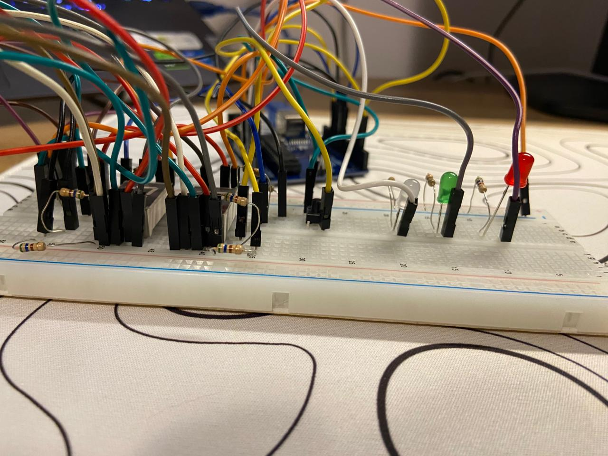
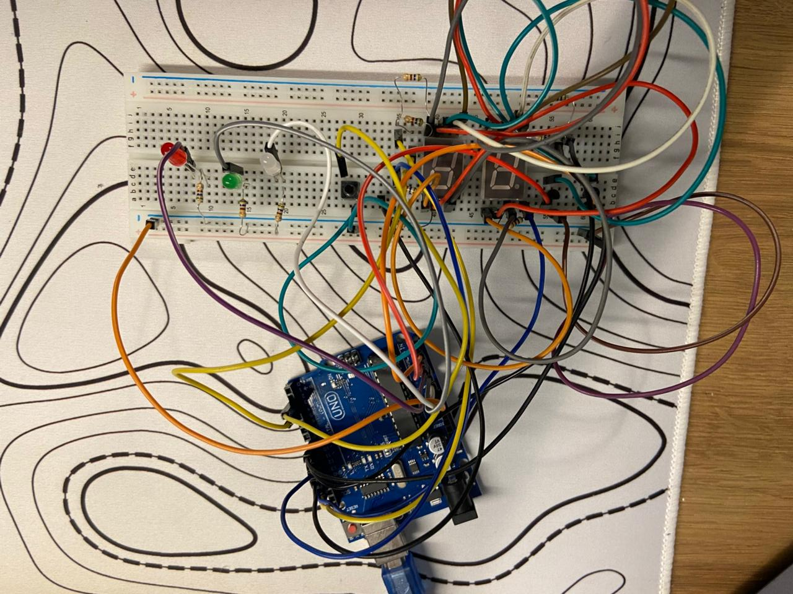
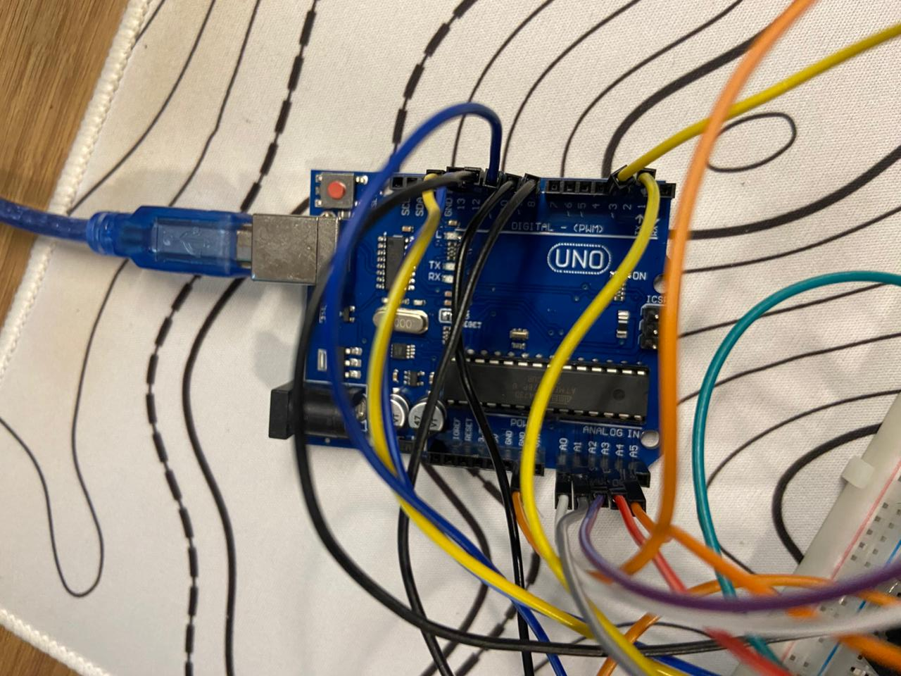
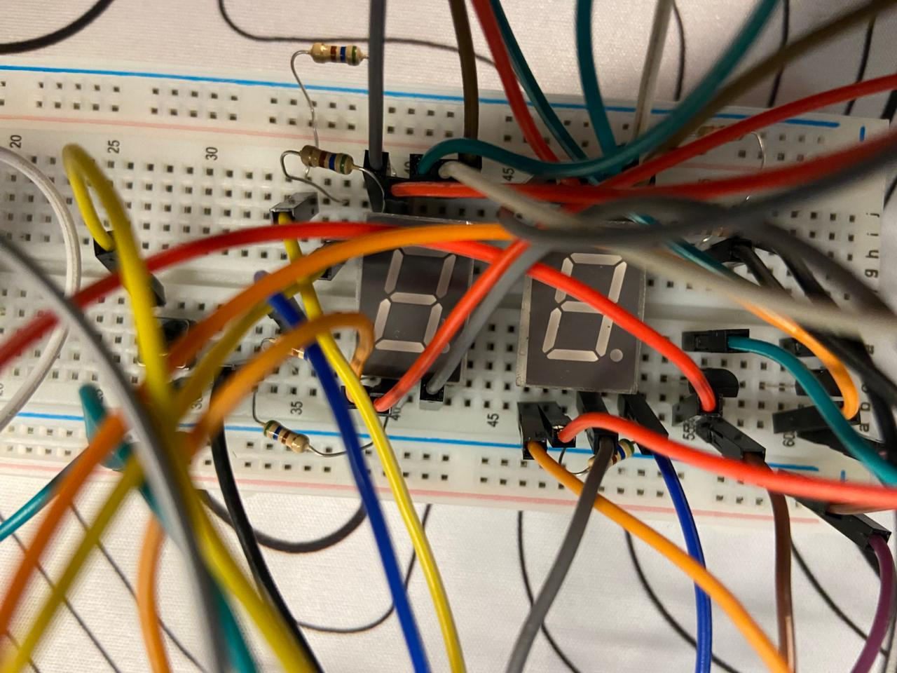
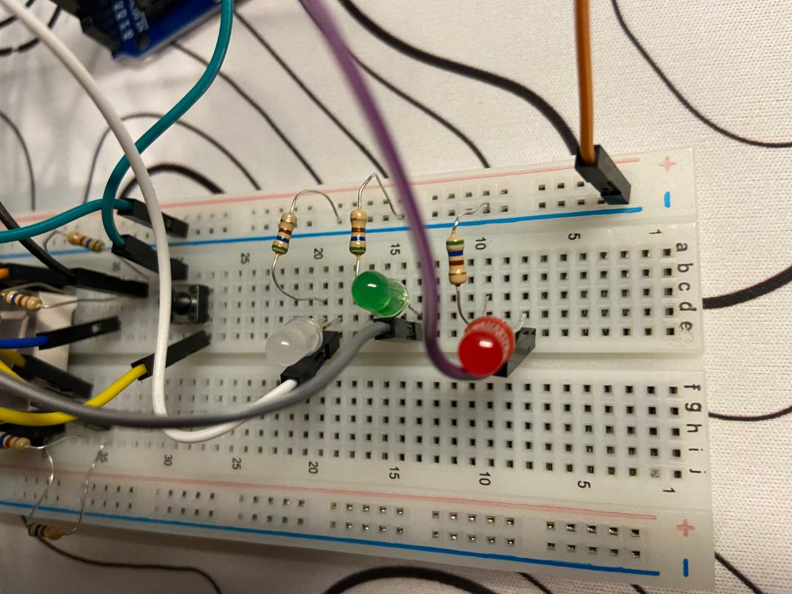
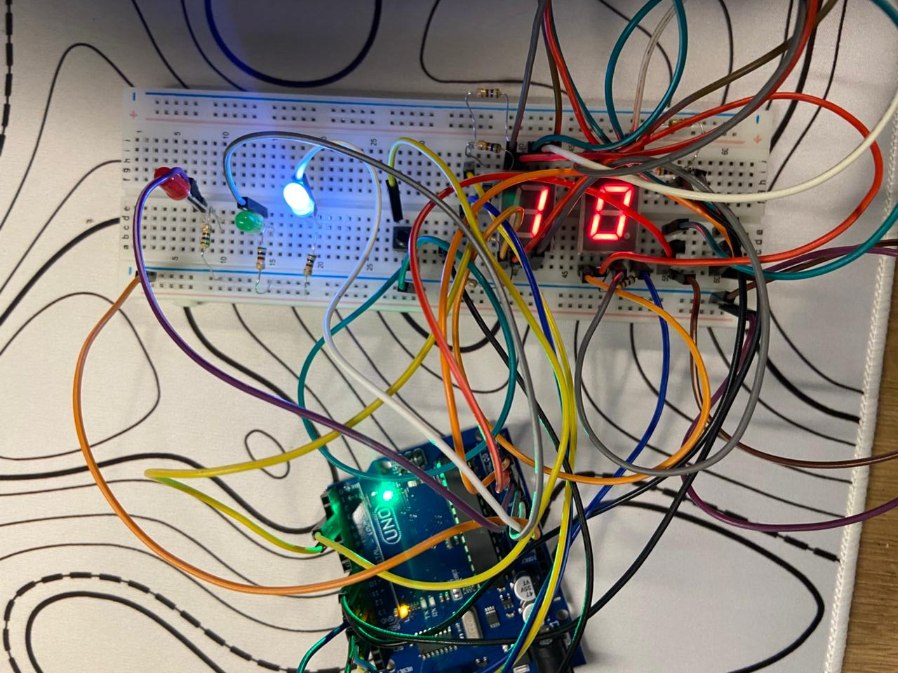
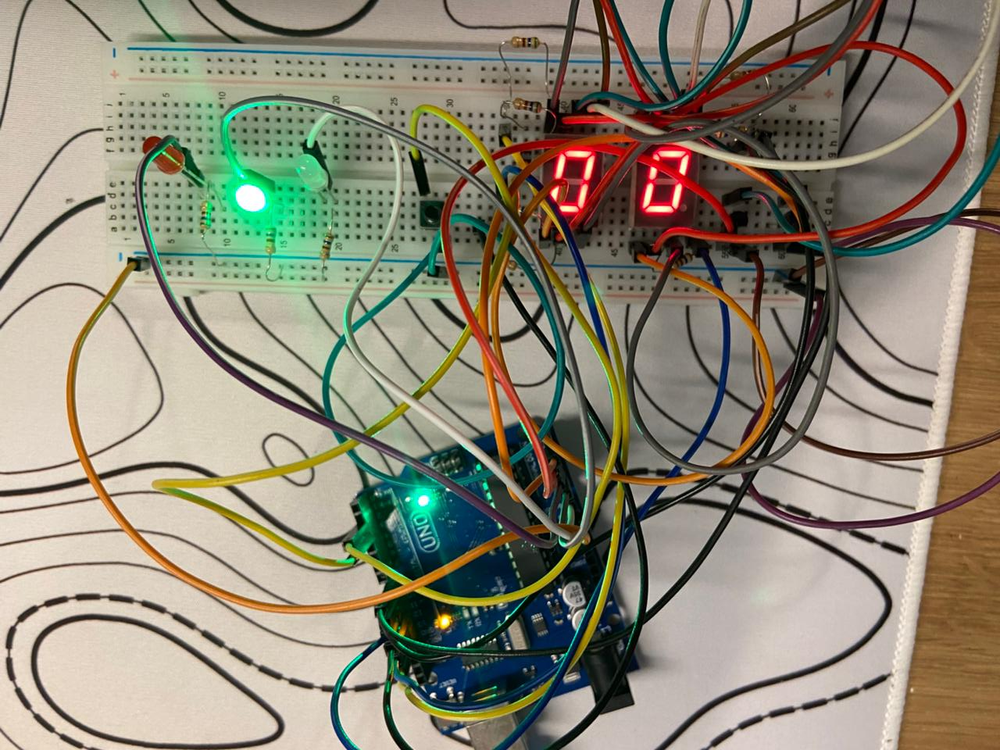
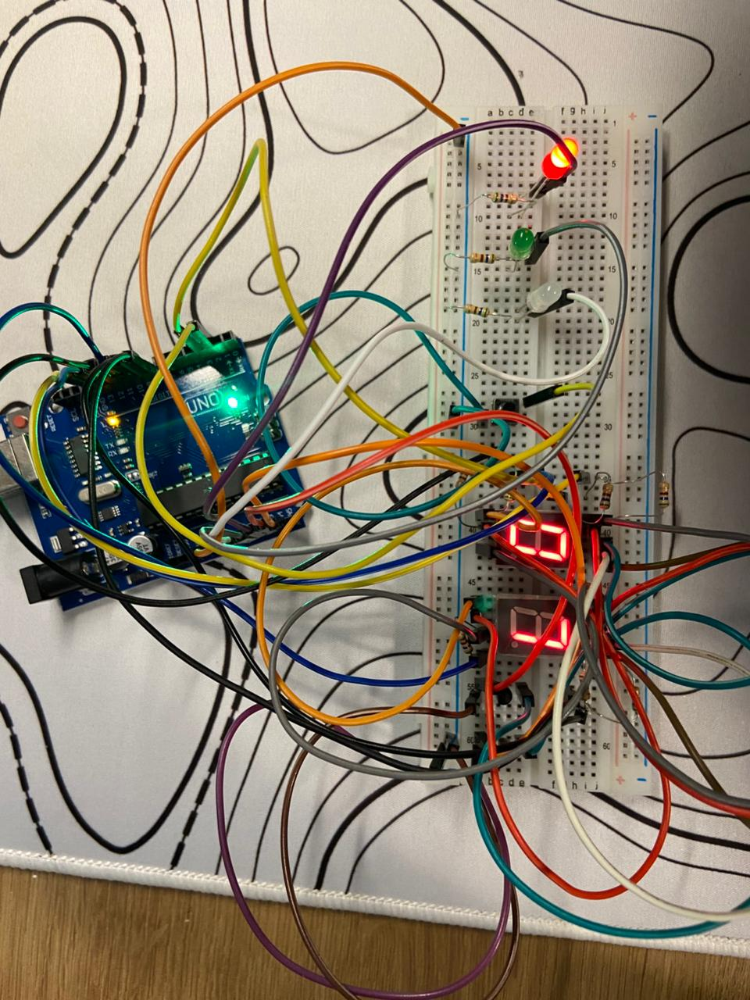

# Circuíto físico

Esta documentação reúne as fotos do circuito físico montado.

### Panorama Geral

---

### Circuito Desligado

---

### Conexões no Arduino Uno

---

### Displays de 7 Segmentos

---

### Leds

Segue a ideia das cores da roleta, porém o led branco substitui a cor preta que tem na roleta, uma vez que não existe led preto.

---

## Imagens do funcionamento

As imagens abaixo mostram o funcionamento do circuito de cores ao acender individualmente cada um dos leds respectivos após o sorteio do número correspondente:

### Led Branco Aceso (representa a cor preta)

---

### Led Verde Aceso

Quando sorteia o número 0.

---

### Led Vermelho Aceso

