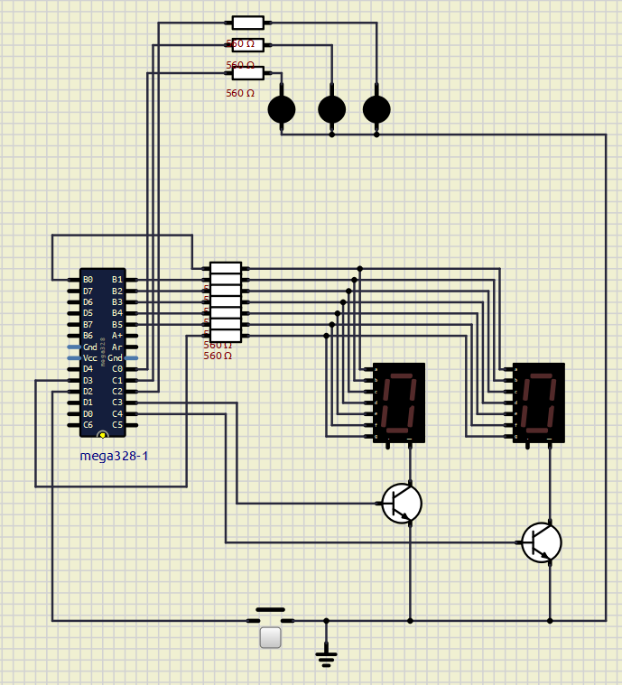
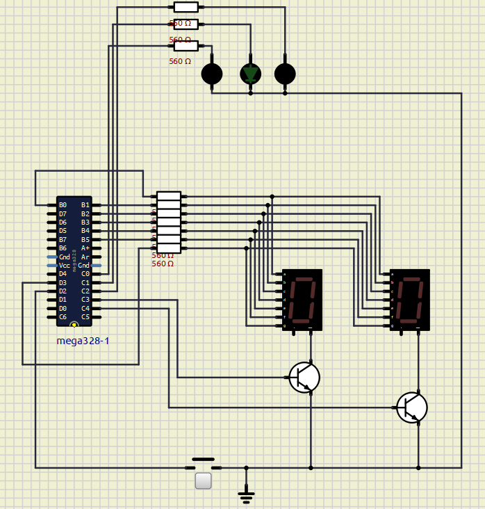
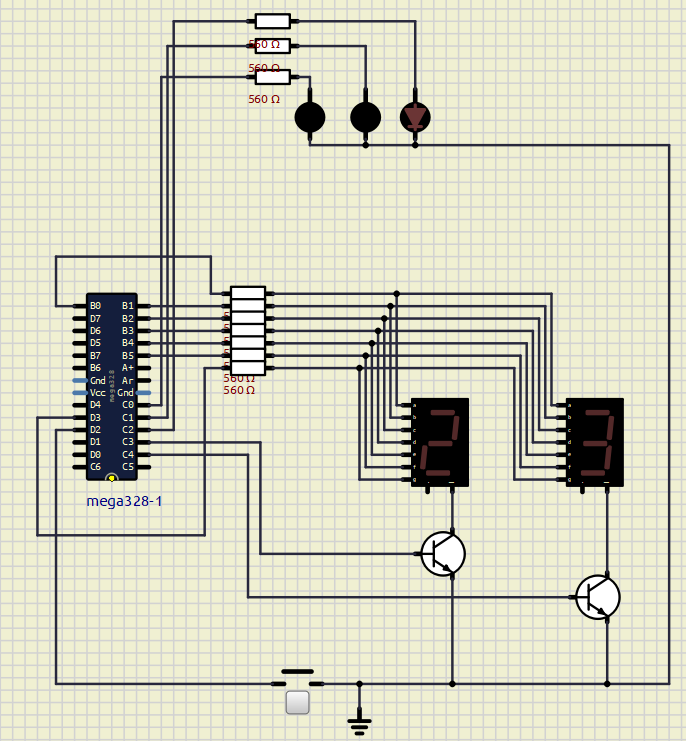
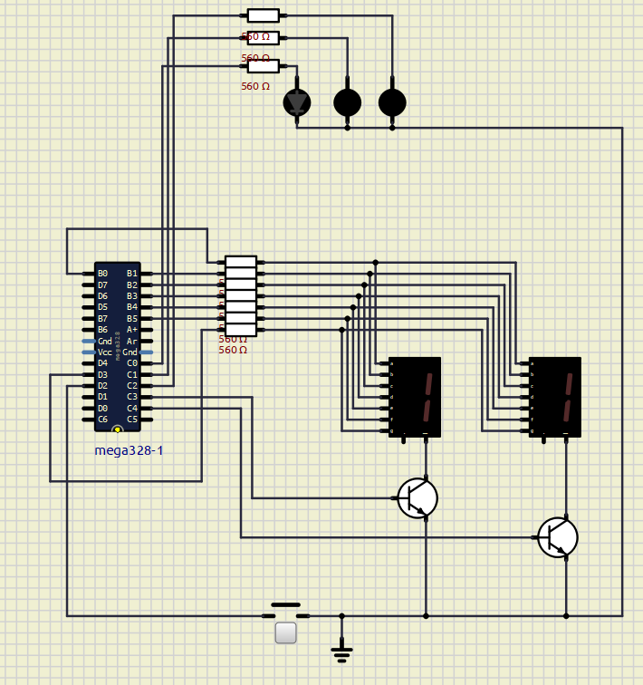

# Diagramas do SimulIDE

Esta documentação reúne as fotos do diagrama no SimulIDE.

---

### Diagrama Inicial

---

### Indicações de Cores Sorteadas

Após terminar a animação, o led correspondente à cor do número sorteado é aceso:

#### Cor Verde (Número 0)

#### Cor Vermelha

#### Cor Branca (Representando a cor preta)

