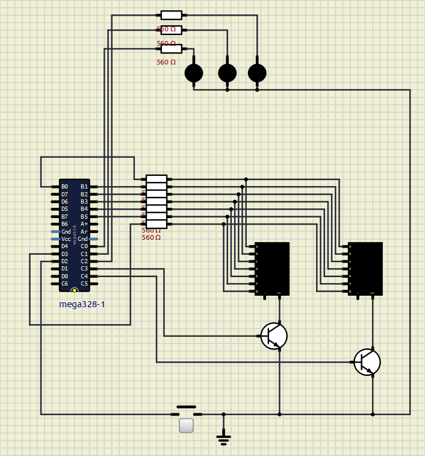

# Interrupção do Botão de Sorteio

Para iniciar o sorteio da roleta, foi utilizada a interrupção externa INT0 do ATMEGA328P. Dessa forma, o microcontrolador não precisa verificar continuamente se o botão foi pressionado, pois o próprio hardware interrompe a execução normal do programa quando ocorre o acionamento.

## Funcionamento

O botão foi configurado utilizando o resistor de pull-up interno do microcontrolador. Assim, enquanto o botão permanece solto, o pino mantém nível lógico alto. Quando o botão é pressionado, ocorre uma transição para nível lógico baixo, acionando a interrupção.

Ao detectar esse evento, o microcontrolador executa uma rotina responsável por iniciar a animação do sorteio, atualizar os displays com o número vencedor e acender o LED correspondente à cor sorteada. Após a execução dessas ações, o programa retorna ao fluxo normal de execução.

A utilização de interrupções torna o sistema mais eficiente, pois elimina a necessidade de verificações constantes do estado do botão, permitindo que o microcontrolador execute outras tarefas até que o usuário solicite um novo sorteio.

### Circuito

Para implementar essa funcionalidade, foi utilizado um botão conectado ao pino PD2 do ATMEGA328P, correspondente à interrupção externa INT0. O uso do pull-up interno elimina a necessidade de componentes adicionais para definir o estado lógico da entrada, simplificando o circuito e reduzindo a quantidade de componentes utilizados.

### Diagrama

Abaixo é apresentado o circuito desenvolvido no SimulIDE. Nele é possível visualizar o botão conectado ao pino PD2 do ATMEGA328P, responsável por acionar a interrupção utilizada para iniciar o sorteio da roleta.

